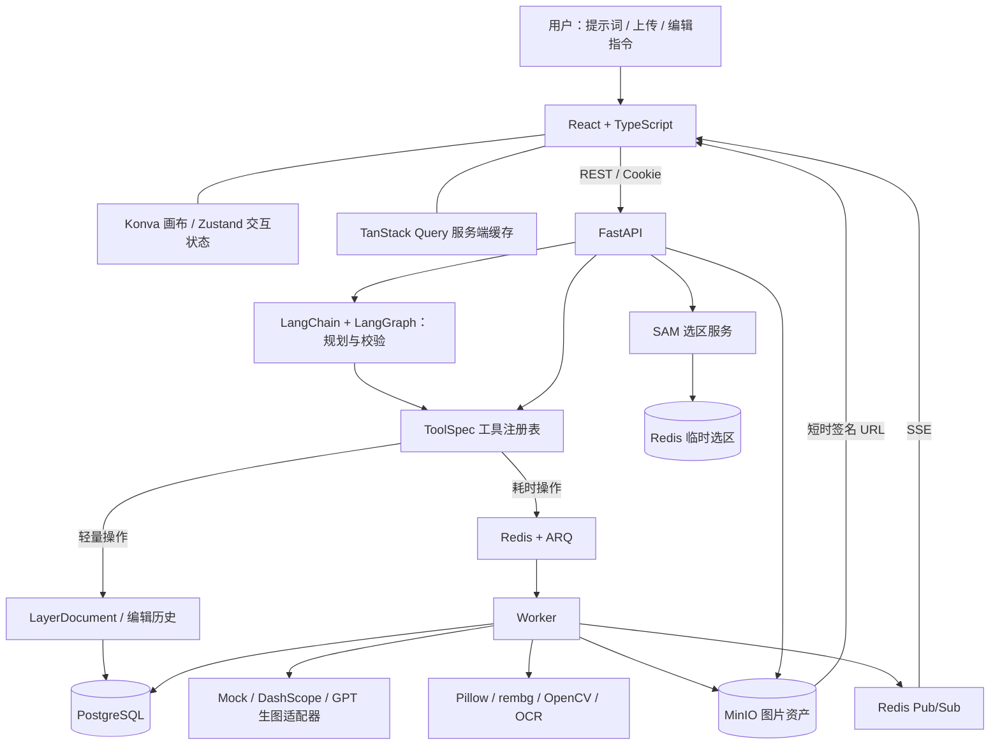
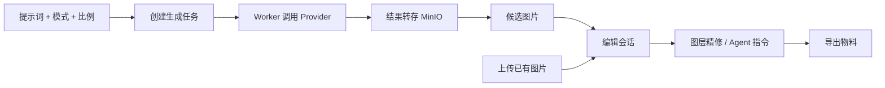
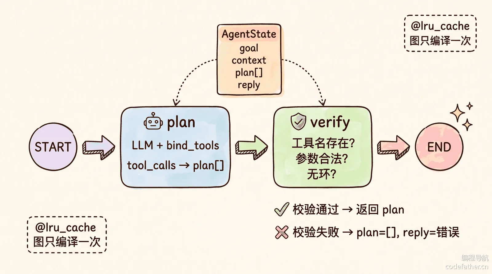
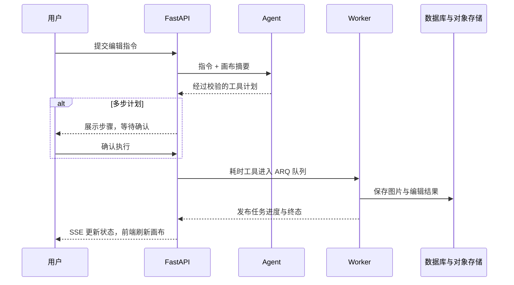
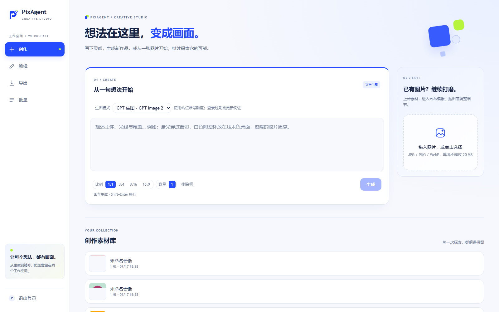
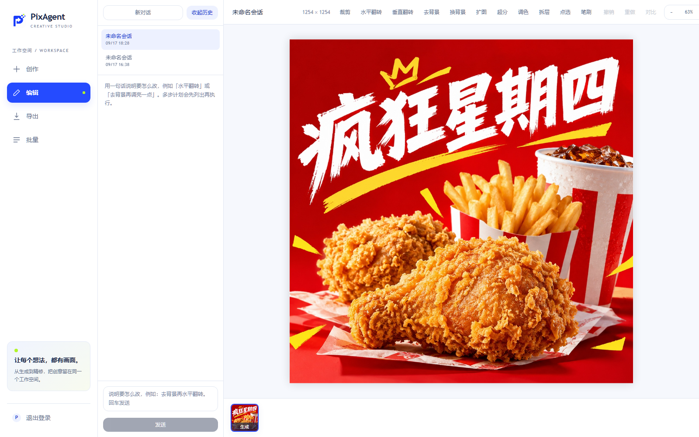

<div align="center">


# PixAgent · 像素智体

**让每个想法，都有画面。**

从自然语言生图，到画布精修与批量交付的 AI 图像创作工作室。


[](LICENSE)
[](https://github.com/Xcaesar1/PixAgent/stargazers)

[项目简介](#项目简介) · [核心亮点](#核心亮点) · [系统架构](#系统架构) · [功能与工作流](#核心功能与工作流) · [运行展示](#实际运行展示) · [快速部署](#快速部署与运行指北) · [代码导读](#目录结构与关键代码导读)

</div>

---

## 项目简介

PixAgent 是一个把 **AI 生成、自然语言编辑、可视化画布和素材交付** 放在同一工作空间的全栈应用。既可以输入提示词生成图片，也可以上传已有素材，通过工具栏精修，或让 Agent 把一句需求拆成可执行的编辑步骤。

它不只是图像模型的聊天窗口：图片进入资产库，编辑形成可恢复的会话，画布由独立图层组成，耗时操作有进度，多步计划可以先确认再执行。适合商品图处理、内容配图、营销物料制作，以及学习 AI Agent 与图像编辑器的工程实现。

> **体验说明**：不配置模型密钥也能用 Mock 模式体验占位图生成、上传、画布与任务流程；自然语言规划需要 DashScope 密钥，真实云端生图和编辑还取决于对应 Provider 配置。Mock 不等于真实 AI 生图。

## 核心亮点

| 亮点 | 实现方式与价值 |
| --- | --- |
| **自然语言驱动编辑** | LangChain 绑定工具，LangGraph 完成 `plan → verify`；规划与执行分离，多步操作先展示计划。 |
| **手动工具与 Agent 共用能力** | 当前注册 **22 个 ToolSpec**，统一工具描述、参数校验与执行入口，减少两套行为不一致的问题。 |
| **国内 / GPT 双生图模式** | 国内模式接入 DashScope，GPT 模式通过独立适配器接入第三方站点；界面显示可用模式并记住选择。 |
| **可继续编辑的画布** | React Konva 管理图层、缩放与平移；支持裁剪、变换、调色预览、前后对比和撤销重做。 |
| **精细到选区的操作** | SAM 点选与笔刷遮罩结合，选区绑定画布版本；局部编辑通过遮罩合成限制修改范围。 |
| **耗时任务不阻塞交互** | ARQ + Redis 执行后台任务，SSE 推送状态，REST 快照补齐任务信息。 |
| **从素材到交付** | 图片墙保留候选结果，支持营销图、多尺寸物料、最多 20 张素材批处理及 ZIP 导出。 |
| **开发与部署分离** | Mock 支持低成本调试；PostgreSQL 保存业务状态，私有 MinIO 保存图片，Docker 多阶段构建打包前后端。 |

## 系统架构

前端负责交互和画布呈现，API 负责认证、校验与业务状态，Agent 负责规划，Worker 负责耗时执行。模型返回的图片会转存到对象存储，而不是长期依赖上游临时链接。



| 层次 | 技术 | 主要职责 |
| --- | --- | --- |
| 前端 | React 19、TypeScript、Vite、Tailwind CSS | 创作页、编辑器、候选图、批量与导出界面。 |
| 画布与状态 | react-konva、Zustand、TanStack Query | 图层渲染、交互状态与服务端数据缓存。 |
| API 与数据 | Python 3.13、FastAPI、Pydantic、SQLAlchemy、Alembic | 身份认证、参数校验、业务查询与数据库迁移。 |
| Agent | LangChain、LangGraph | 工具调用规划、参数与依赖检查。 |
| 异步执行 | ARQ、Redis、SSE | 后台任务、进度事件和临时选区。 |
| 图像处理 | Pillow、rembg、ONNX Runtime、OpenCV、RapidOCR | 合成、抠图、分割、局部处理与文字识别。 |
| 持久化 | PostgreSQL、MinIO / S3 | 会话、历史、任务、资产元信息与图片文件。 |

## 核心功能与工作流

### 1. 从提示词到编辑会话

选择生图模式，填写提示词、比例和数量；后台完成生成后，候选图进入资产库，选中图片即可开始编辑。也可以直接上传 JPG、PNG 或 WebP，跳过生成环节。



| 模式 | 配置 | 当前适配范围 |
| --- | --- | --- |
| Mock 占位图 | `IMAGE_PROVIDER=mock` | 非生产环境调试使用，不调用生图模型。 |
| 国内生图 | `DASHSCOPE_API_KEY` + `GENERATION_PROVIDER=dashscope` | 表单支持多种比例与数量；实际模型能力和计费以服务商为准。 |
| GPT 生图 | `L0VEYOU_TOKEN_FILE` + `GENERATION_PROVIDER=l0veyou` | 当前每次 1 张，支持 1:1、3:4、9:16、16:9，不支持参考图和随机种子。 |

GPT 模式使用第三方站点账号额度，**不是 OpenAI 官方 API 接入，也不承诺永久免费**。登录凭证只放在服务端受限文件中，过期后需要更新。`GENERATION_PROVIDER` 只控制生图默认模式，不会自动改变编辑工具的 `IMAGE_PROVIDER`。

### 2. 自然语言规划与人工确认

例如输入「先去背景，再调亮一点」。Agent 读取画布摘要，输出工具计划；服务端验证工具名、参数和依赖关系。单步计划直接进入执行流程，多步计划先由用户确认，支持取消与失败步骤重试。

<details>
<summary>展开查看 plan → verify 示意图</summary>



配图来自用户提供的《AI 修图智能体：面试题解》（编程导航），保留原图标识；用于解释规划流程，不是线上运行截图。

</details>



### 3. 画布、图层与局部编辑

- **画布操作**：缩放、平移、适应视口、裁剪，以及图层移动、缩放、旋转和翻转。
- **图层编辑**：显隐、透明度、层序与文字编辑；支持主体 / 背景拆分，以及将选中物体提升为图层。
- **区域精修**：点选或笔刷圈定区域后执行消除、替换；画布版本变化后，旧选区失效，避免错位编辑。
- **修改可回退**：保存线性编辑历史，支持撤销、重做和前后对比；选区拥有独立撤销栈。

### 4. 营销物料与批量交付

营销流程提供主图、场景图、模特图与海报入口，结果进入图片墙；多尺寸工具生成适配投放的物料。批处理支持最多 20 张素材，统一执行去背景、换背景、调色、超分、扩图或尺寸处理，并查看逐项状态、导出结果包。

真实换背景、扩图等生成式编辑需要启用对应云端编辑 Provider；不能把 Mock 结果视为实际模型效果。

## 实际运行展示

以下为 **2026-09-17 已部署 PixAgent 的真实页面截图**，不是设计稿。截图过程只打开已有页面和会话，没有新增付费生成任务。

### 创作工作空间

生图模式、提示词、画幅设置、上传入口与历史素材集中展示。



### 历史会话与画布编辑

打开已保存的素材后，左侧可切换历史会话，右侧加载图像画布与编辑工具栏。



| 已有验证记录 | 结果与边界 |
| --- | --- |
| HTTPS 与入口保护 | 已验证入口认证、应用登录、私有图片签名访问和关闭自由注册。 |
| 国内生图链路 | 曾完成单张 1024 × 1024 PNG 生成测试；可用额度与费用以账户后台为准。 |
| 历史会话 | 已验证两条会话点击进入、相互切换及刷新后的画布加载。 |
| 本地图像能力 | 已完成 U2NetP、量化 SAM 与 RapidOCR 的部署验收；不代表并发压测结果。 |

## 快速部署与运行指北

### 环境准备

| 运行方式 | 所需环境 |
| --- | --- |
| 全容器本地体验 | Git、Docker Engine / Docker Desktop、Docker Compose。 |
| 本地开发 | 另需 Python 3.13、uv、Node.js 22.12+ 与 npm。 |
| 真实 AI 能力 | DashScope API Key；GPT 模式另需配置第三方账号凭证文件。 |

### 方式一：Docker 本地体验

以下命令在 PowerShell 执行。默认使用 Mock，不产生生图 API 费用。

```powershell
git clone https://github.com/Xcaesar1/PixAgent.git
cd PixAgent
Copy-Item .env.example .env

# 先启动数据库、队列和对象存储
docker compose up -d

# 构建应用，并初始化数据库结构
docker compose --profile deploy build
docker compose --profile deploy run --rm app alembic upgrade head

# 启动 API、前端静态页面和 Worker
docker compose --profile deploy up -d
```

访问 [本地应用](http://localhost:7302)、[API 文档](http://localhost:7302/api/docs) 或 [健康检查](http://localhost:7302/api/health)。本地默认允许注册；首次打开应用后创建账号。

> 此 Compose 含开发默认凭据和数据库端口映射，仅用于受信任的本地环境，不能原样部署到公网。生产部署请使用独立配置，参见下方说明。

### 方式二：本地开发

先在项目根目录启动基础服务，并为后端创建配置文件。**宿主机运行的后端读取 `backend/.env`；Compose 读取根目录 `.env`，不要混淆。**

```powershell
docker compose up -d
Copy-Item .env.example backend/.env
```

在三个独立终端中，从项目根目录分别执行：

**终端 A：API**

```powershell
cd backend
uv sync --frozen --all-extras
uv run alembic upgrade head
uv run uvicorn app.main:app --reload --host 127.0.0.1 --port 7302
```

**终端 B：Worker**

```powershell
cd backend
uv run arq app.worker.WorkerSettings
```

**终端 C：前端**

```powershell
cd frontend
npm ci
npm run dev
```

访问 [开发页面](http://127.0.0.1:7301)。Vite 将 `/api` 与 `/events` 代理到后端；本地图像模型首次使用可能需要下载模型文件。

### 模型与存储配置

按运行方式修改根目录 `.env` 或 `backend/.env`，配置变更后重启 API 与 Worker。

| 配置项 | 用途 |
| --- | --- |
| `IMAGE_PROVIDER` | 编辑工具 Provider，默认 `mock`，真实云端编辑使用 `dashscope`。 |
| `GENERATION_PROVIDER` | 生图默认模式，可设 `dashscope`、`l0veyou`；空值沿用 `IMAGE_PROVIDER`。 |
| `DASHSCOPE_API_KEY` | 国内生图、DashScope 编辑及自然语言规划所需密钥。 |
| `TEXT_TO_IMAGE_MODEL` | 国内生图模型，当前默认 `qwen-image-3.0-pro`。 |
| `IMAGE_EDIT_MODEL` | 图像编辑模型，当前默认 `qwen-image-edit-max`。 |
| `PLANNER_MODEL` | 指令规划模型，当前默认 `qwen-plus`。 |
| `L0VEYOU_TOKEN_FILE` | GPT 模式的服务端凭证文件路径；容器需要只读挂载。 |
| `DATABASE_URL` / `REDIS_URL` | 数据库和队列连接。 |
| `S3_ENDPOINT` / `S3_PUBLIC_ENDPOINT` | 服务端存储地址 / 浏览器可访问的签名地址。 |
| `JWT_SECRET` | 登录签名密钥，公网部署必须替换开发默认值。 |

仅启用国内生图、保留 Mock 编辑时，可以使用：

```dotenv
IMAGE_PROVIDER=mock
GENERATION_PROVIDER=dashscope
DASHSCOPE_API_KEY=your_dashscope_api_key
```

需要真实云端编辑时再将 `IMAGE_PROVIDER` 改为 `dashscope`。密钥只放环境配置，不能写进前端、截图或提交记录；是否收费、免费额度及支持模型以服务商控制台为准。

### 公网部署

生产环境需要独立 Compose 配置、独立密码、HTTPS、访问控制、SSE 代理配置、图片外部访问地址及数据备份。当前部署实例的 VPS 配置和运维记录尚未随本次文档更新发布。

数据库、Redis 和 MinIO 管理端不应公开暴露。生产使用 `APP_ENV=production` 和关闭自由注册的配置，并预先规划账号开通方式。本文双生图模式与运行截图描述当前部署实例；对应扩展代码尚未随本次文档提交发布。

### 开发检查

```powershell
cd frontend
npm run lint
npm run build
```

后端测试必须指向**独立测试数据库和 Redis 实例或 DB**，不要使用生产数据：

```powershell
cd backend
# 先配置独立测试环境的 DATABASE_URL 与 REDIS_URL
uv run pytest
```

## 目录结构与关键代码导读

```text
PixAgent/
├── assets/                        # 品牌图片、README 配图与真实截图
├── backend/
│   ├── app/
│   │   ├── agent/                 # LangGraph 规划、模型绑定与计划校验
│   │   ├── tools/                 # ToolSpec 注册与各类工具定义
│   │   ├── providers/             # Mock、DashScope、GPT 生图适配
│   │   ├── services/              # 会话、任务、资产、选区、批量与导出
│   │   ├── edits/                 # 渲染、抠图、分割、OCR 与遮罩处理
│   │   ├── routers/               # REST API 与 SSE 路由
│   │   ├── models/                # SQLAlchemy 数据模型
│   │   ├── schemas/               # 请求与响应校验
│   │   ├── tasks/                 # 后台任务入口
│   │   ├── eval/                  # 图像任务评测代码与样例
│   │   ├── layers.py              # LayerDocument 图层文档
│   │   ├── storage.py             # S3 上传、下载与签名
│   │   └── worker.py              # ARQ Worker 配置
│   ├── migrations/                # 数据库迁移
│   └── tests/                     # 后端测试
├── frontend/
│   └── src/
│       ├── pages/                 # 创作、编辑、候选图、营销与批量页面
│       ├── components/editor/     # 画布、工具栏、会话与图层面板
│       ├── hooks/                 # 查询、任务进度与编辑交互
│       ├── stores/                # Zustand 状态
│       └── api/                   # API 客户端与类型
├── .env.example                   # 环境变量模板，无真实密钥
├── Dockerfile                     # 前端构建 + Python 运行时
├── docker-compose.yml             # 本地基础服务与完整体验 profile
└── README.md                      # 项目介绍与运行指南
```

| 想了解什么 | 从这里开始 |
| --- | --- |
| 新增一个工具如何进入 Agent | [`tools/base.py`](backend/app/tools/base.py) → [`tools/__init__.py`](backend/app/tools/__init__.py) → [`agent/llm.py`](backend/app/agent/llm.py)。 |
| 一句话怎样变成可执行计划 | [`agent/graph.py`](backend/app/agent/graph.py) → [`agent/plan.py`](backend/app/agent/plan.py) → [`services/agent.py`](backend/app/services/agent.py)。 |
| 生图调用与表单从哪里读 | [`providers/__init__.py`](backend/app/providers/__init__.py) → [`services/generation.py`](backend/app/services/generation.py) → [`GenerateForm.tsx`](frontend/src/components/GenerateForm.tsx)。 |
| 编辑历史与图层如何保存 | [`layers.py`](backend/app/layers.py) → [`services/sessions.py`](backend/app/services/sessions.py)。 |
| 选区怎样绑定画布版本 | [`services/selections.py`](backend/app/services/selections.py) → [`edits/segment.py`](backend/app/edits/segment.py) → [`useSelection.ts`](frontend/src/hooks/useSelection.ts)。 |
| 实时进度怎样到达浏览器 | [`queue.py`](backend/app/queue.py) → [`events.py`](backend/app/events.py) → [`routers/events.py`](backend/app/routers/events.py) → [`useRun.ts`](frontend/src/hooks/useRun.ts)。 |
| 画布交互从哪里读 | [`EditorPage.tsx`](frontend/src/pages/EditorPage.tsx) → [`CanvasStage.tsx`](frontend/src/components/editor/CanvasStage.tsx) → [`canvasView.ts`](frontend/src/stores/canvasView.ts)。 |
| 多图任务与交付怎样组织 | [`services/batch.py`](backend/app/services/batch.py) 与 [`services/exports.py`](backend/app/services/exports.py)。 |

## Star History

[](https://www.star-history.com/#Xcaesar1/PixAgent&Date)

## 许可证

本项目代码采用 [GNU General Public License v2.0（GPL-2.0-only）](LICENSE)。第三方配图、商标与依赖遵循各自的授权条款。

<div align="center">

**PixAgent · 从一个想法，到一张可交付的图片。**

</div>
