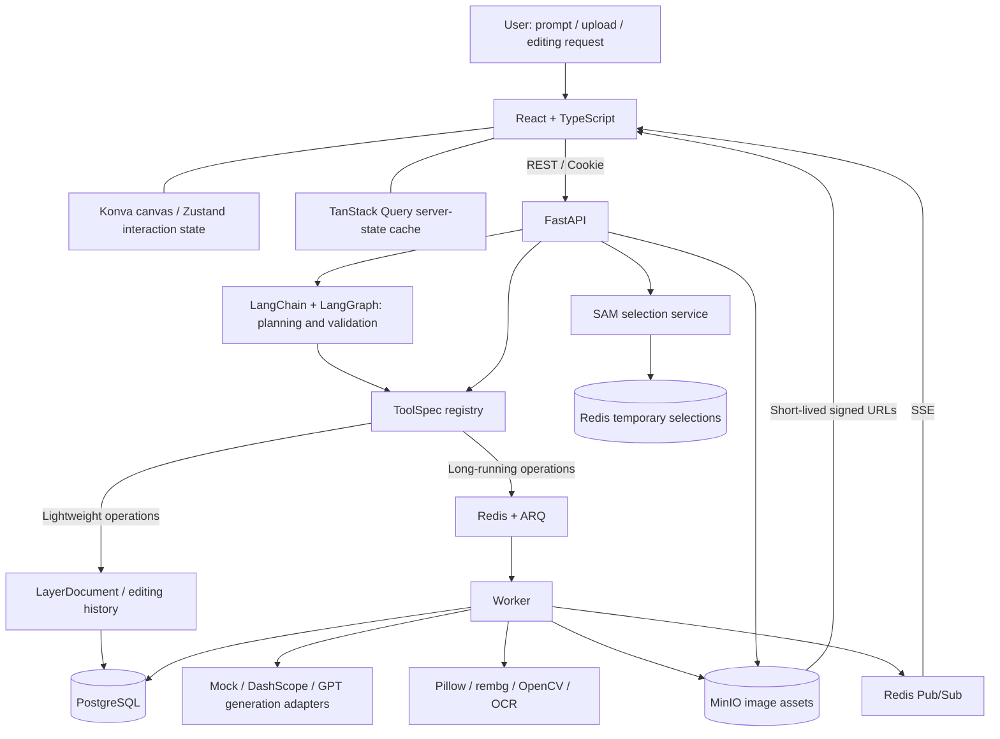
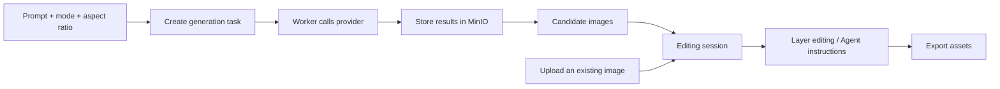
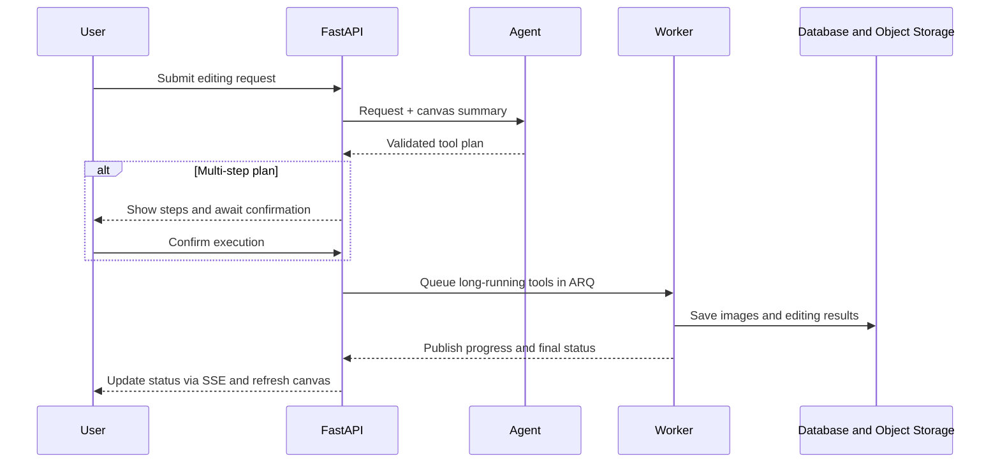
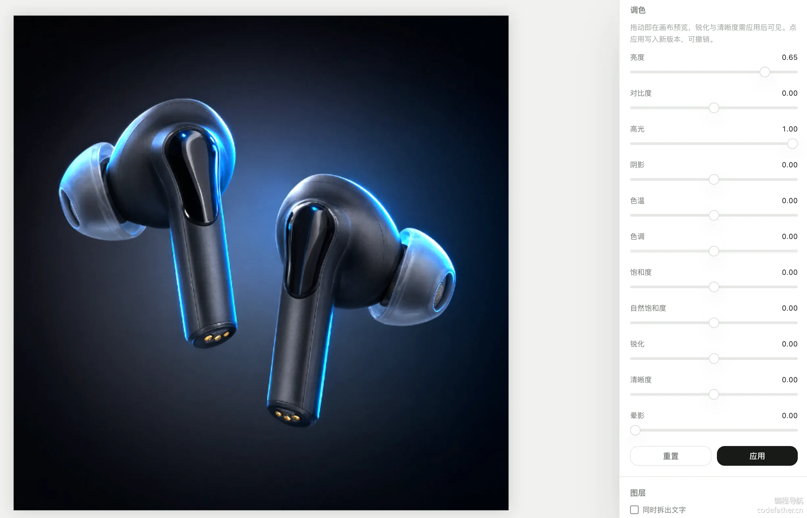
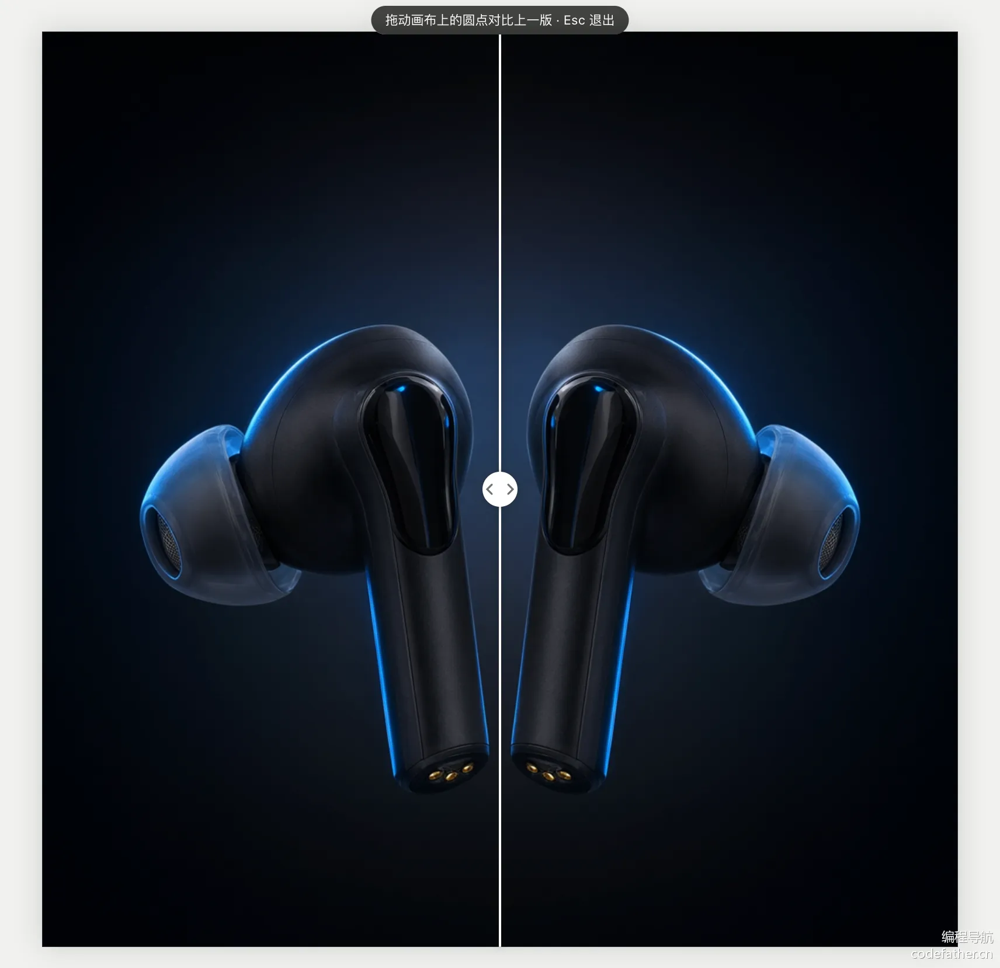
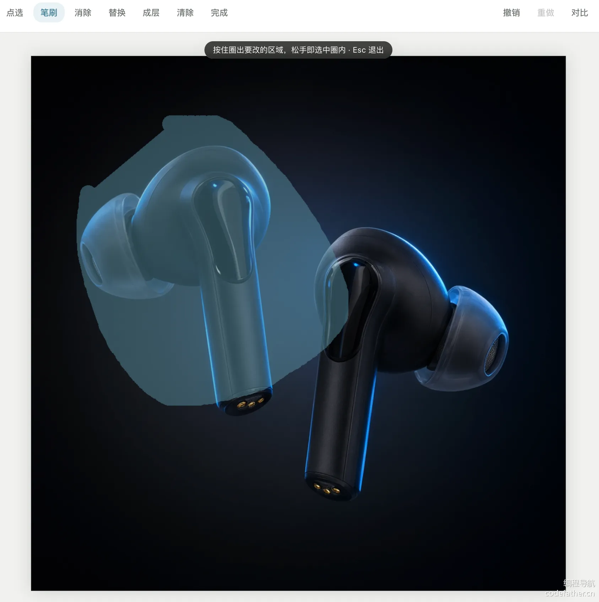

<div align="center">


# PixAgent

[简体中文](README.md) | **English**

**Give every idea an image.**

An AI image creation workspace, from natural-language generation to canvas editing and batch delivery.


[](LICENSE)
[](https://github.com/Xcaesar1/PixAgent/actions/workflows/ci.yml)
[](https://github.com/Xcaesar1/PixAgent/stargazers)

[Overview](#overview) · [Highlights](#highlights) · [Architecture](#architecture) · [Features and Workflows](#features-and-workflows) · [Showcase](#showcase) · [Getting Started](#getting-started) · [Code Guide](#project-structure-and-code-guide)

</div>

---

## Overview

PixAgent is a full-stack application combining **AI generation, natural-language editing, a visual canvas, and asset delivery** in one workspace. Generate images from prompts, upload existing assets for manual editing, or let the Agent turn a request into executable editing steps.

It is more than a chat interface for an image model: images enter an asset library, edits belong to resumable sessions, the canvas contains independent layers, long-running operations report progress, and multi-step plans can be reviewed before execution. Use it for product imagery, editorial illustrations, marketing assets, or exploring how AI agents and image editors are built.

> **Trying it out:** Without model credentials, Mock mode supports placeholder generation, uploads, canvas interaction, and task workflows. Natural-language planning requires a DashScope key; cloud generation and editing also require the appropriate provider configuration. Mock mode is not real AI image generation.

## Highlights

| Highlight | Implementation and value |
| --- | --- |
| **Natural-language editing** | LangChain binds tools and LangGraph runs `plan -> verify`. Planning is separate from execution, with multi-step plans shown first. |
| **Shared tools for manual editing and the Agent** | **22 registered ToolSpecs** share descriptions, parameter validation, and execution entry points. |
| **DashScope / GPT generation modes** | DashScope powers the China-based provider mode; a separate adapter connects GPT mode to a third-party site. The UI lists available modes and remembers the selection. |
| **Resumable canvas editing** | React Konva manages layers, zoom, and pan, with cropping, transforms, color previews, before/after comparison, undo, and redo. |
| **Selection-level operations** | SAM point selection and brush masks are tied to canvas versions. Masked compositing restricts local edits to the selected region. |
| **Non-blocking background tasks** | ARQ and Redis execute long-running work. SSE streams status updates, while REST snapshots provide task state. |
| **From assets to delivery** | Candidate galleries, marketing workflows, multi-size outputs, batches of up to 20 assets, and ZIP exports. |
| **Separate development and deployment concerns** | Mock supports low-cost development; PostgreSQL stores business state, private MinIO stores images, and multi-stage Docker builds package the frontend and backend. |

## Architecture

The frontend handles interaction and canvas rendering. The API handles authentication, validation, and business state; the Agent plans operations; the Worker executes expensive tasks. Generated images are copied into object storage rather than relying on temporary upstream URLs.



| Layer | Technologies | Responsibilities |
| --- | --- | --- |
| Frontend | React 19, TypeScript, Vite, Tailwind CSS | Creation page, editor, candidates, batch processing, and export UI. |
| Canvas and state | react-konva, Zustand, TanStack Query | Layer rendering, interaction state, and server-data caching. |
| API and data | Python 3.13, FastAPI, Pydantic, SQLAlchemy, Alembic | Authentication, validation, queries, and database migrations. |
| Agent | LangChain, LangGraph | Tool-call planning, parameter validation, and dependency checks. |
| Async execution | ARQ, Redis, SSE | Background jobs, progress events, and temporary selections. |
| Image processing | Pillow, rembg, ONNX Runtime, OpenCV, RapidOCR | Compositing, background removal, segmentation, local processing, and text recognition. |
| Persistence | PostgreSQL, MinIO / S3 | Sessions, history, tasks, asset metadata, and image files. |

## Features and Workflows

### 1. From Prompt to Editing Session

Select a generation mode, enter a prompt, and choose an aspect ratio and image count. Generated candidates enter the asset library; select one to begin editing. Alternatively, upload a JPG, PNG, or WebP and skip generation.



| Mode | Configuration | Adapter capabilities |
| --- | --- | --- |
| Mock placeholders | `IMAGE_PROVIDER=mock` | Non-production development without calling an image generation model. |
| DashScope generation | `DASHSCOPE_API_KEY` + `GENERATION_PROVIDER=dashscope` | Multiple aspect ratios and image counts in the form; supported capabilities and billing depend on the provider. |
| GPT generation | `L0VEYOU_TOKEN_FILE` + `GENERATION_PROVIDER=l0veyou` | One image per request; supports 1:1, 3:4, 9:16, and 16:9. Reference images and random seeds are not supported. |

### 2. Natural-Language Planning and Confirmation

For example: "Remove the background, then make it slightly brighter." The Agent reads a canvas summary and returns a tool plan. The server validates tool names, parameters, and dependencies. Single-step plans proceed to execution; multi-step plans require confirmation. Cancellation and retrying failed steps are supported.



### 3. Canvas, Layers, and Local Editing

- **Canvas operations:** zoom, pan, fit to viewport, crop, and move, scale, rotate, or flip layers.
- **Layer editing:** visibility, opacity, ordering, and text editing; separate subjects from backgrounds or promote selected objects to layers.
- **Local retouching:** select a region with points or a brush, then remove or replace content. Old selections become invalid when the canvas version changes to prevent misaligned edits.
- **Reversible changes:** linear editing history supports undo, redo, and before/after comparison. Selections have an independent undo stack.

### 4. Marketing Assets and Batch Delivery

Marketing workflows offer product, scene, model, and poster images, with results collected in a gallery. Multi-size tools prepare assets for different placements. Batch processing supports up to 20 assets for background removal or replacement, color adjustments, super-resolution, outpainting, or resizing, with per-item status and packaged exports.

## Showcase

### Creation Workspace

Generation modes, prompts, aspect ratios, uploads, and asset history in one place.


### Complex Product Scene: Shadows and Highlights

Dark earbuds combine reflective shells, translucent tips, blue rim lighting, and a dark background. These details make it easier to inspect adjustments than simply displaying a poster. The image shows brightness and highlight controls alongside the canvas preview.



**Checks:** Inspect shadow visibility and blown highlights when adjusting brightness and highlights. Applying changes should save a new version that can be undone. The screenshot shows controls and a preview; saving versions and undo must be checked interactively.

### Version Comparison: Composition and Subject Changes

Use the canvas divider to compare the previous and current versions side by side. Earbud orientation, reflections, and tip edges provide clear visual reference points.



**Checks:** Drag the divider across matching regions and verify alignment after zooming and panning. Exiting comparison should restore the current version. This illustrates the comparison interaction, not a quantitative image-quality improvement.

### Local Selection: One Subject in a Multi-Object Scene

Both earbuds share the same image. The brush selects the left earbud, with a blue overlay showing the selection. This tests whether users can target a specific object rather than operating on the whole image.



**Checks:** Verify coverage of the target and accidental selection of the other earbud. Compare regions inside and outside the selection after subsequent edits. The screenshot shows selection state, not completed removal, replacement, or precise matting.

### Complex Scene Test Assets

#### 01. Outdoor Gear: Multi-Object Selection and Local Editing


Backpack straps, mesh pockets, clothing, plants, and shadows on stone create a layered scene. The blue bottle is an unambiguous editing target.

| Test operation | What to check |
| --- | --- |
| Select the blue bottle with points or a brush | Cover the cap and body without selecting the backpack, compass, or background. |
| Remove only the selected bottle | Inspect stone texture and shadow continuity; confirm that straps and the compass outside the selection remain unchanged. |
| Adjust shadows and color temperature, apply, then undo | Shadow texture should remain visible; applying should create a version and undo should restore the original. |

#### 02. Conservatory Cat: Fur, Whiskers, and Transparent Edges


The cat's fur and fine whiskers overlap background foliage. The vase adds transparent glass, water, and thin stems for examining difficult edge cases.

| Test operation | What to check |
| --- | --- |
| Select and cut out the cat, then place it on dark and light backgrounds | Zoom into ears, whiskers, and tail; record missing details, background remnants, and color halos rather than judging only the thumbnail. |
| Select the glass vase separately | Check the rim, handle, and stems without including the cat. |
| Stress-test transparent-object matting on the vase | Look for retained background or glass rendered opaque; do not assume high-quality transparency and refraction handling. |

#### 03. Coffee Poster: OCR, Text Layers, and Multi-Size Delivery


The poster combines headlines, small copy, a currency symbol, and dates with ceramic, glass, food, and fabric textures. It supports checking both text recognition and composition preservation.

| Test operation | What to check |
| --- | --- |
| Recognize text and inspect text layers | Check "春日咖啡节", "SPRING COFFEE", "第二杯半价", "¥28", and the date "04.01–04.07", along with text-box positions and missed small print. |
| Edit a recognized text layer | Save and reopen the session; verify content and position persist, and inspect the original text region for remnants. |
| Export 1:1, 4:5, and 9:16 versions | Check pixel ratios and preservation of the headline and price. Distinguish padding from cropping; padding is not intelligent layout rearrangement. |
| Export a batch and extract its ZIP | Confirm the file count matches the selection and every image opens correctly, without missing or mixed-up files. |

### Existing Verification Records

| Area | Results and scope |
| --- | --- |
| HTTPS and entry protection | Entry authentication, application login, signed private-image access, and disabled public registration verified. |
| DashScope generation | A single 1024 x 1024 PNG generation test completed; remaining quota and costs depend on the account dashboard. |
| Session history | Opening two sessions, switching between them, and loading the canvas after refresh verified. |
| Local image capabilities | Deployment acceptance completed for U2NetP, quantized SAM, and RapidOCR; this is not concurrent load-test evidence. |

## Getting Started

### Prerequisites

| Setup | Requirements |
| --- | --- |
| Fully containerized local trial | Git, Docker Engine / Docker Desktop, Docker Compose. |
| Local development | Additionally Python 3.13, uv, Node.js 22.12+, and npm. |
| Real AI capabilities | A DashScope API key; GPT mode also requires a third-party account credential file. |

### Option 1: Local Docker Setup

Run these commands in PowerShell. The default Mock provider does not incur image generation API charges.

```powershell
git clone https://github.com/Xcaesar1/PixAgent.git
cd PixAgent
Copy-Item .env.example .env

# Start the database, queue, and object storage
docker compose up -d

# Build the application and initialize the database schema
docker compose --profile deploy build
docker compose --profile deploy run --rm app alembic upgrade head

# Start the API, served frontend, and Worker
docker compose --profile deploy up -d
```

Open the [local application](http://localhost:7302), [API documentation](http://localhost:7302/api/docs), or [health endpoint](http://localhost:7302/api/health). Registration is enabled locally by default; create an account on your first visit.

> This Compose configuration includes development credentials and published database ports. Use it only in a trusted local environment, not unchanged on the public internet. Production requires a separate configuration as described below.

### Option 2: Local Development

Start infrastructure from the repository root and create the backend configuration. **The host-run backend reads `backend/.env`; Compose reads the root `.env`. These are separate files.**

```powershell
docker compose up -d
Copy-Item .env.example backend/.env
```

Start each of the following in a separate terminal, initially at the repository root.

**Terminal A: API**

```powershell
cd backend
uv sync --frozen --all-extras
uv run alembic upgrade head
uv run uvicorn app.main:app --reload --host 127.0.0.1 --port 7302
```

**Terminal B: Worker**

```powershell
cd backend
uv run arq app.worker.WorkerSettings
```

**Terminal C: Frontend**

```powershell
cd frontend
npm ci
npm run dev
```

Open the [development UI](http://127.0.0.1:7301). Vite proxies `/api` and `/events` to the backend. Local image models may download their weights on first use.

### Model and Storage Configuration

Edit the root `.env` or `backend/.env` according to your setup, then restart the API and Worker.

| Setting | Purpose |
| --- | --- |
| `IMAGE_PROVIDER` | Editing tool provider: `mock` by default, or `dashscope` for cloud editing. |
| `GENERATION_PROVIDER` | Default generation mode: `dashscope` or `l0veyou`; an empty value inherits `IMAGE_PROVIDER`. |
| `DASHSCOPE_API_KEY` | Key for DashScope generation, editing, and natural-language planning. |
| `TEXT_TO_IMAGE_MODEL` | DashScope generation model, currently defaulting to `qwen-image-3.0-pro`. |
| `IMAGE_EDIT_MODEL` | Editing model, currently defaulting to `qwen-image-edit-max`. |
| `PLANNER_MODEL` | Planning model, currently defaulting to `qwen-plus`. |
| `L0VEYOU_TOKEN_FILE` | Server-side GPT credential file path; mount read-only in containers. |
| `DATABASE_URL` / `REDIS_URL` | Database and queue connections. |
| `S3_ENDPOINT` / `S3_PUBLIC_ENDPOINT` | Server-side storage endpoint / browser-accessible endpoint for signed URLs. |
| `JWT_SECRET` | Login signing key; replace the development default before public deployment. |

To enable DashScope generation while keeping Mock editing:

```dotenv
IMAGE_PROVIDER=mock
GENERATION_PROVIDER=dashscope
DASHSCOPE_API_KEY=your_dashscope_api_key
```

Set `IMAGE_PROVIDER=dashscope` when cloud editing is needed. Keep keys in environment configuration, never in frontend code, screenshots, or commits. Consult the provider dashboard for billing, free quotas, and supported models.

### Public Deployment

Production requires separate Compose configuration, unique passwords, HTTPS, access control, SSE proxy settings, external image URLs, and backups. The current deployment's VPS configuration and operations records have not been published with this documentation update.

Do not expose PostgreSQL, Redis, or MinIO administration endpoints publicly. Use `APP_ENV=production`, disable public registration, and plan account provisioning. The dual-generation modes and runtime screenshots in this document describe the deployed instance; the corresponding extension code has not yet been published with this documentation commit.

### Development Checks

```powershell
cd frontend
npm run lint
npm run build
```

Backend tests must use a **dedicated test database and Redis instance or logical DB**, never production data:

```powershell
cd backend
# Configure DATABASE_URL and REDIS_URL for an isolated test environment first
uv run pytest
```

## Project Structure and Code Guide

See the [CI workflow](.github/workflows/ci.yml) and [CI guide](.github/CI.md). Pushes and pull requests trigger backend tests, migration checks, frontend lint, and builds. Checks use Mock mode, do not call paid image providers, and do not deploy automatically.

```text
PixAgent/
|-- .github/                       # CI workflow and check documentation
|-- assets/                        # Branding, README images, and screenshots
|-- backend/
|   |-- app/
|   |   |-- agent/                 # LangGraph planning, model binding, validation
|   |   |-- tools/                 # ToolSpec registry and tool definitions
|   |   |-- providers/             # Mock, DashScope, GPT generation adapters
|   |   |-- services/              # Sessions, tasks, assets, selections, batches, exports
|   |   |-- edits/                 # Rendering, matting, segmentation, OCR, masks
|   |   |-- routers/               # REST API and SSE routes
|   |   |-- models/                # SQLAlchemy data models
|   |   |-- schemas/               # Request and response validation
|   |   |-- tasks/                 # Background task entry points
|   |   |-- eval/                  # Image task evaluation code and examples
|   |   |-- layers.py              # LayerDocument model
|   |   |-- storage.py             # S3 uploads, downloads, signed URLs
|   |   `-- worker.py              # ARQ Worker configuration
|   |-- migrations/                # Database migrations
|   `-- tests/                     # Backend tests
|-- frontend/
|   `-- src/
|       |-- pages/                 # Creation, editor, candidates, marketing, batch pages
|       |-- components/editor/     # Canvas, toolbar, session and layer panels
|       |-- hooks/                 # Queries, task progress, editing interactions
|       |-- stores/                # Zustand state
|       `-- api/                   # API client and types
|-- .env.example                   # Environment template without real keys
|-- Dockerfile                     # Frontend build and Python runtime
|-- docker-compose.yml             # Local infrastructure and full-app profile
|-- README.md                      # Chinese overview and setup guide
`-- README_en.md                   # English overview and setup guide
```

| What to explore | Start here |
| --- | --- |
| Registering a tool with the Agent | [`tools/base.py`](backend/app/tools/base.py) -> [`tools/__init__.py`](backend/app/tools/__init__.py) -> [`agent/llm.py`](backend/app/agent/llm.py). |
| Turning a request into an executable plan | [`agent/graph.py`](backend/app/agent/graph.py) -> [`agent/plan.py`](backend/app/agent/plan.py) -> [`services/agent.py`](backend/app/services/agent.py). |
| Generation calls and the form | [`providers/__init__.py`](backend/app/providers/__init__.py) -> [`services/generation.py`](backend/app/services/generation.py) -> [`GenerateForm.tsx`](frontend/src/components/GenerateForm.tsx). |
| Persisting editing history and layers | [`layers.py`](backend/app/layers.py) -> [`services/sessions.py`](backend/app/services/sessions.py). |
| Binding selections to canvas versions | [`services/selections.py`](backend/app/services/selections.py) -> [`edits/segment.py`](backend/app/edits/segment.py) -> [`useSelection.ts`](frontend/src/hooks/useSelection.ts). |
| Delivering progress to the browser | [`queue.py`](backend/app/queue.py) -> [`events.py`](backend/app/events.py) -> [`routers/events.py`](backend/app/routers/events.py) -> [`useRun.ts`](frontend/src/hooks/useRun.ts). |
| Canvas interactions | [`EditorPage.tsx`](frontend/src/pages/EditorPage.tsx) -> [`CanvasStage.tsx`](frontend/src/components/editor/CanvasStage.tsx) -> [`canvasView.ts`](frontend/src/stores/canvasView.ts). |
| Multi-image jobs and delivery | [`services/batch.py`](backend/app/services/batch.py) and [`services/exports.py`](backend/app/services/exports.py). |

## Star History

[](https://www.star-history.com/#Xcaesar1/PixAgent&Date)

## License

The project code is licensed under the [GNU General Public License v2.0 (GPL-2.0-only)](LICENSE). Third-party images, trademarks, and dependencies remain subject to their respective terms.

<div align="center">

**PixAgent: from an idea to an image ready for delivery.**

</div>
